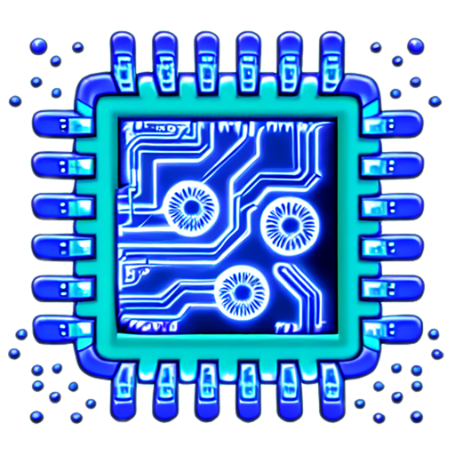
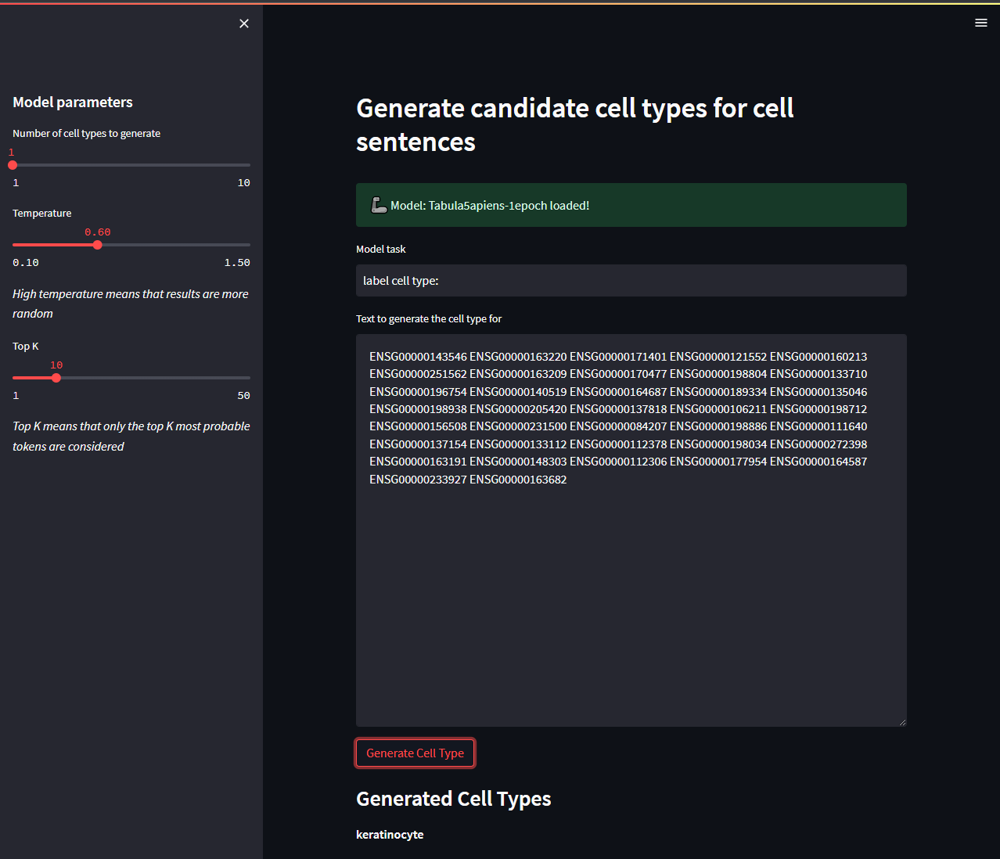

# scLLM: Generative Large Language Models for Single-Cell Omics

<p align="center" width="100%">
  
</p>

scLLM is work in progress side project aiming to explore the development of generative single-cell omics large language models. A proof of concept model, Tabula5apiens, was developed and uses cell intrinsic rank ordered gene expression as sentences to train and use large language models (LLMs) for generating cell types with high accuracy. We leverage the state-of-the-art (SOTA) architectures and the Hugging Face Transformers library to create a powerful and effective pipeline for analyzing single-cell RNA-seq data, with more advanced goals on the horizon, such as multiomics.

This project is currently in development and is not yet ready for use. Please check back soon for updates!

## ⚡️ Features

- 🧪 Takes advantage of SOTA open source architectures such as GPT-2 and T5
- 📝 Uses cell intrinsic sentence representation
- 🎯 High accuracy cell type generation
- 🛠️ Easy-to-use API with customizable options
- 🤗 Built on top of the Hugging Face Transformers library and PyTorch

## 📷 Example

<p align="center" width="100%">
  
</p>

## 📦 Installation

```bash
git clone https://github.com/jzinno/scLLM.git
cd scLLM
pip install -r requirements.txt

```

## ⌛ Upcoming

- Rigorous testing
- Preprint
- Publish model(s) to Hugging Face Model Hub
- Explore multiomics

## 🤝 Contributing

We welcome contributions! Please read our Contributing Guidelines (if they exist) before submitting a pull request or opening an issue.
